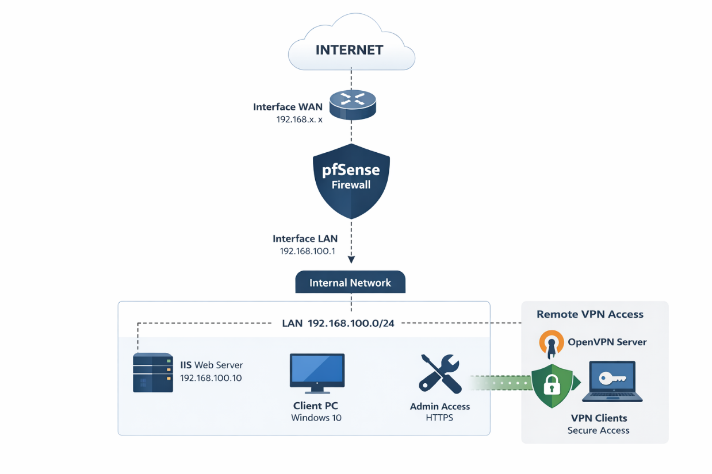
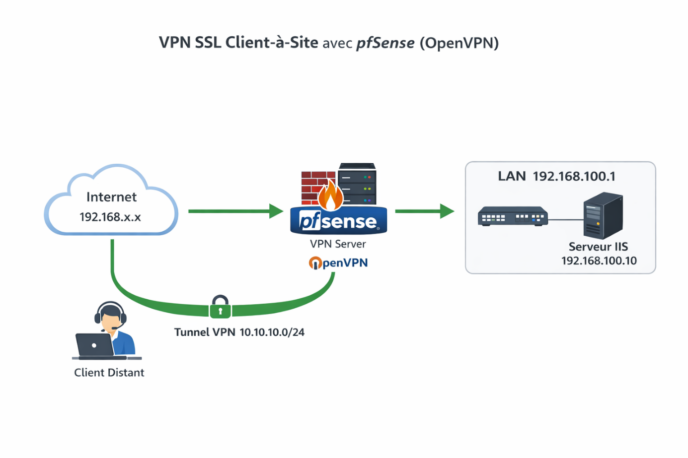
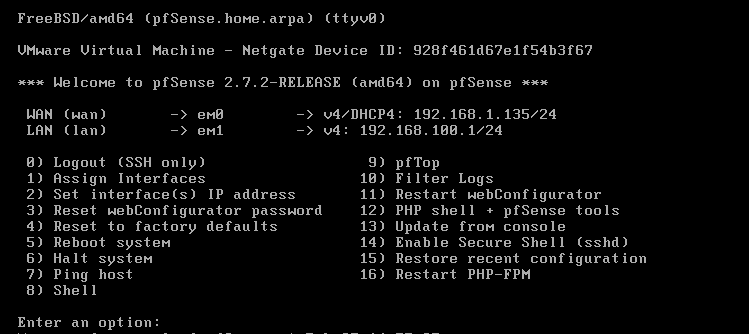
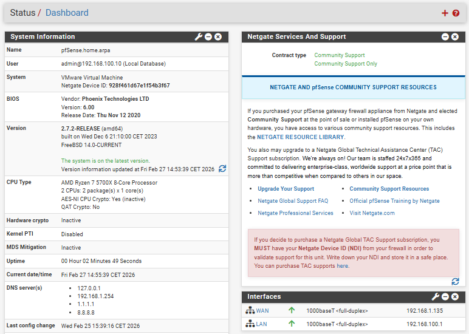
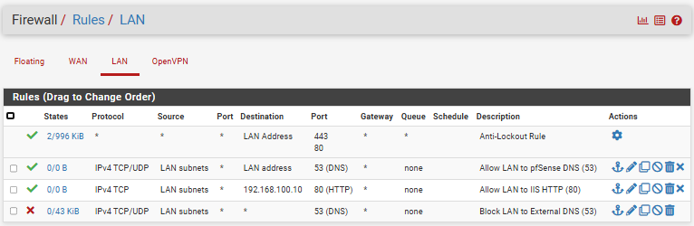
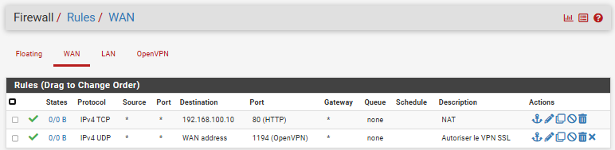
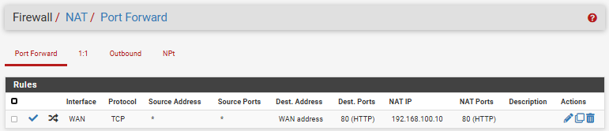
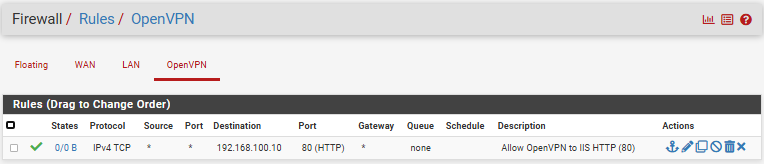
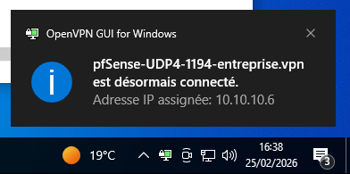
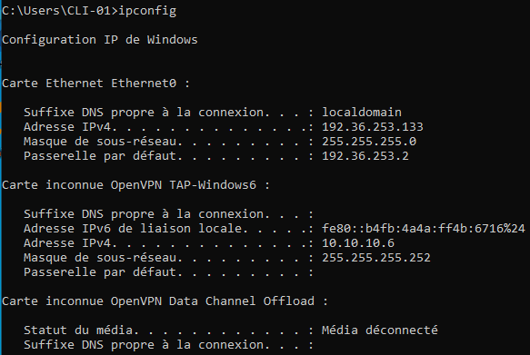

# Secure Network Architecture with pfSense, IIS and OpenVPN

## Project Overview

This project consists of designing and deploying a secure network architecture simulating a corporate environment.

The infrastructure is based on:

- pfSense (firewall and routing)
- Windows Server 2022 with IIS
- OpenVPN (SSL Client-to-Site VPN)
- Windows 10 (remote client workstation)
- VMware Workstation (virtualized environment)

The objective is to implement fundamental cybersecurity mechanisms:

- Network segmentation
- Strict traffic filtering
- Controlled publication via NAT
- Encrypted remote access
- Internal PKI infrastructure

---

## Global Architecture

The architecture relies on a clear separation between WAN (Internet) and internal LAN.

### Applied Principles:

- WAN / LAN segmentation
- Centralized firewall (pfSense)
- Internal web server not directly exposed
- Controlled publication via NAT
- Remote access only through secure VPN

---

## SSL Client-to-Site VPN (OpenVPN)

Secure remote connection via encrypted tunnel to the internal LAN network.

### VPN Characteristics:

- Mode: Remote Access (SSL/TLS + User Auth)
- Protocol: UDP 1194
- Encryption: AES-256
- Authentication: certificate + password
- Topology: net30 (client isolation)
- Security directive: `auth-nocache`

---

## Addressing Plan

| Element      | Address           |
|--------------|------------------|
| LAN          | 192.168.100.0/24 |
| pfSense LAN  | 192.168.100.1    |
| IIS Server   | 192.168.100.10   |
| VPN Tunnel   | 10.10.10.0/30    |

---

## Firewall Configuration

### LAN Interface
- Allow DNS to pfSense
- Allow HTTP to IIS server
- Block external DNS
- Apply least privilege principle

### WAN Interface
- Allow OpenVPN (UDP 1194)
- Publish HTTP via NAT rule
- No other exposed services

### OpenVPN Interface
- Allow HTTP to IIS only
- No full LAN access

---

## NAT – Port Forwarding

Configuration:

- Interface: WAN
- Protocol: TCP
- External Port: 80
- Redirect to: 192.168.100.10
- Internal Port: 80

Objective:

- Controlled publication of the Web server
- Masking of internal addressing
- Minimal exposure

---

## PKI Infrastructure

- Internal Certificate Authority (CA)
- OpenVPN server certificate
- User certificate
- Strong SSL/TLS authentication

---

## Testing and Validation

### Tests Performed:

- Internal HTTP access functional
- External DNS blocking validated
- WAN publication via NAT operational
- Remote VPN connection successful
- Tunnel IP assignment confirmed (10.10.10.x)
- Access to IIS server via VPN tunnel validated

---

## Proof of Operation

### pfSense Console

### pfSense Dashboard

### LAN Firewall Rules

### WAN Firewall Rules

### NAT Configuration

### OpenVPN Rules

### Active VPN Tunnel

### Tunnel IP Assignment

### IIS Access via VPN

---

## Implemented Security

- Strict network segmentation
- Precise traffic filtering
- External DNS blocking
- Robust VPN encryption
- VPN client isolation
- Strict control of exposed services
- Strong SSL/TLS authentication

---

## Possible Improvements

- Dedicated DMZ implementation
- IDS/IPS deployment (Snort / Suricata)
- HTTPS publication with public certificate
- Reverse Proxy
- Active Directory integration
- MFA implementation
- Advanced pfSense hardening

---

## Project Structure

<pre>
pfsense-openvpn-iis-secure-lab/
├── README.md
├── docs/
│   ├── ip_addressing_plan.md
│   ├── logical_architecture.md
│   └── technical_environment.md
├── firewall/
│   ├── lan_firewall_rules.md
│   ├── openvpn_firewall_rules.md
│   └── wan_firewall_rules.md
├── nat/
│   └── nat_port_forwarding_configuration.md
├── tests/
│   ├── internal_access_test.md
│   ├── vpn_connection_test.md
│   └── wan_publication_test.md
└── vpn/
    ├── openvpn_security_parameters.md
    ├── openvpn_server_configuration.md
    └── pki_infrastructure.md
</pre>

---

## Author

**Sriram**  
Cybersecurity Student  

Personal project carried out as part of a technical deepening process and practical implementation of network infrastructure security best practices.
